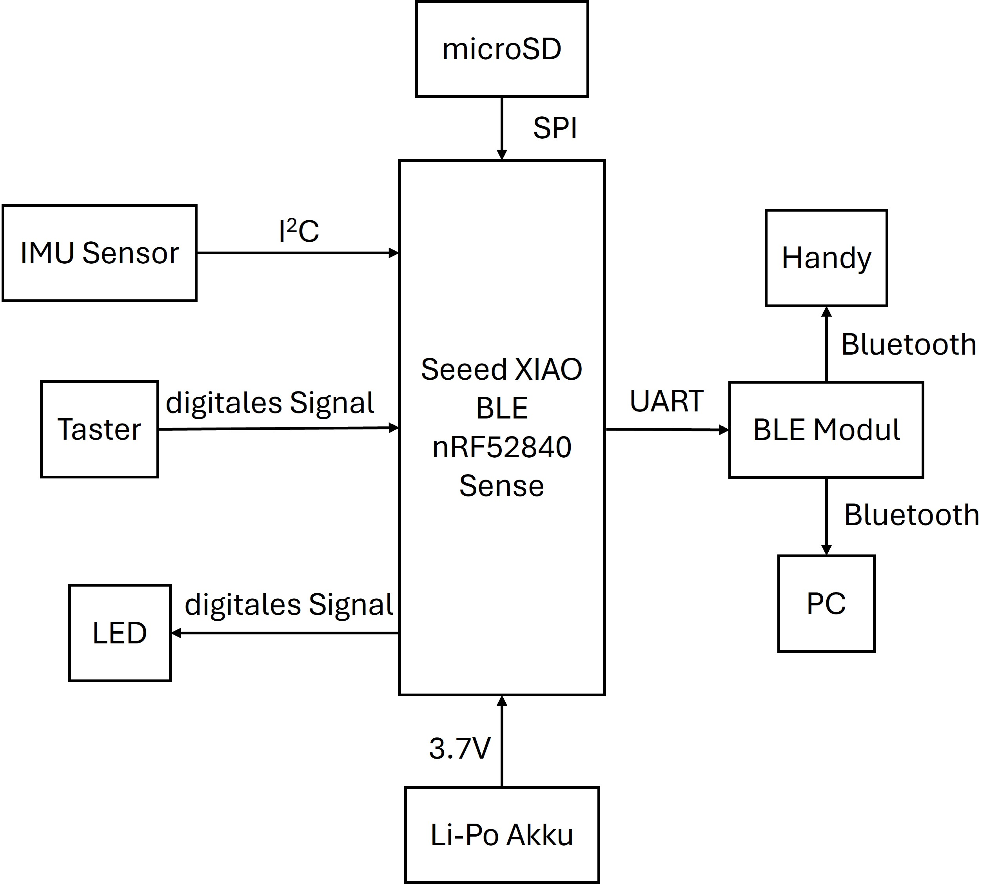
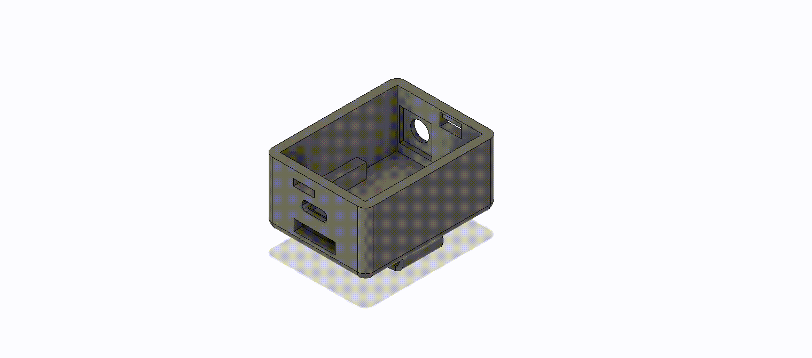
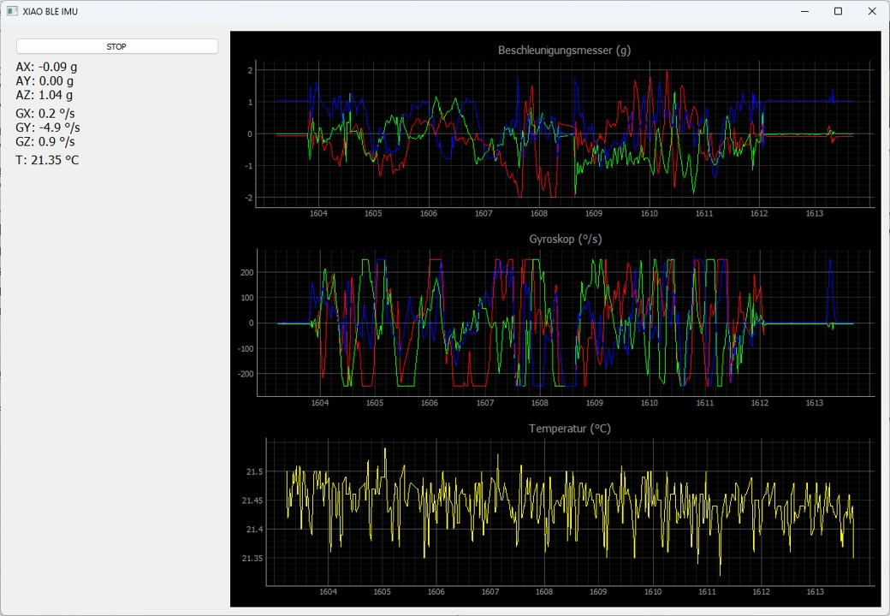
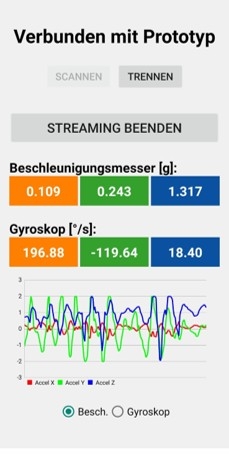
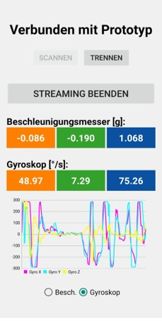
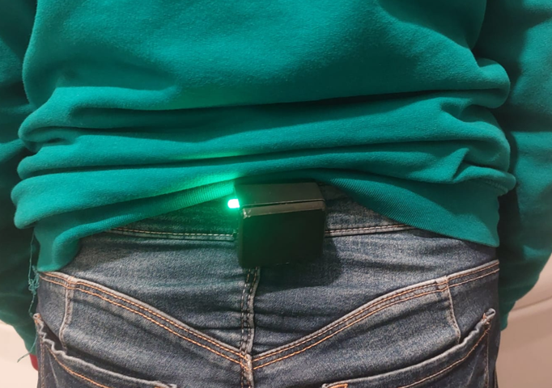
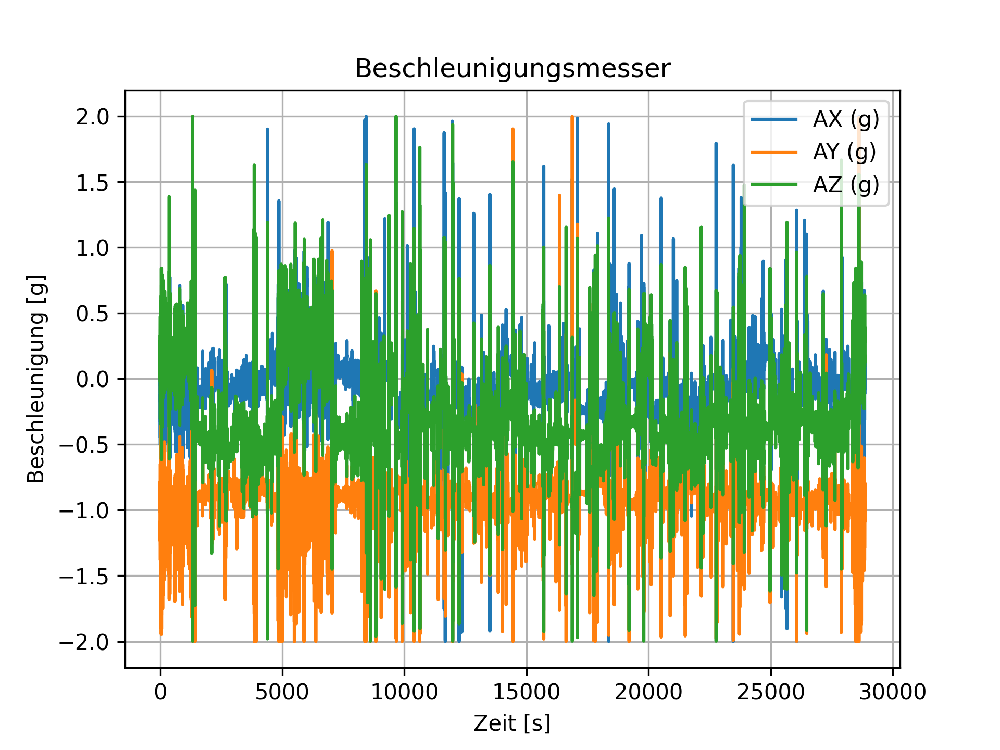
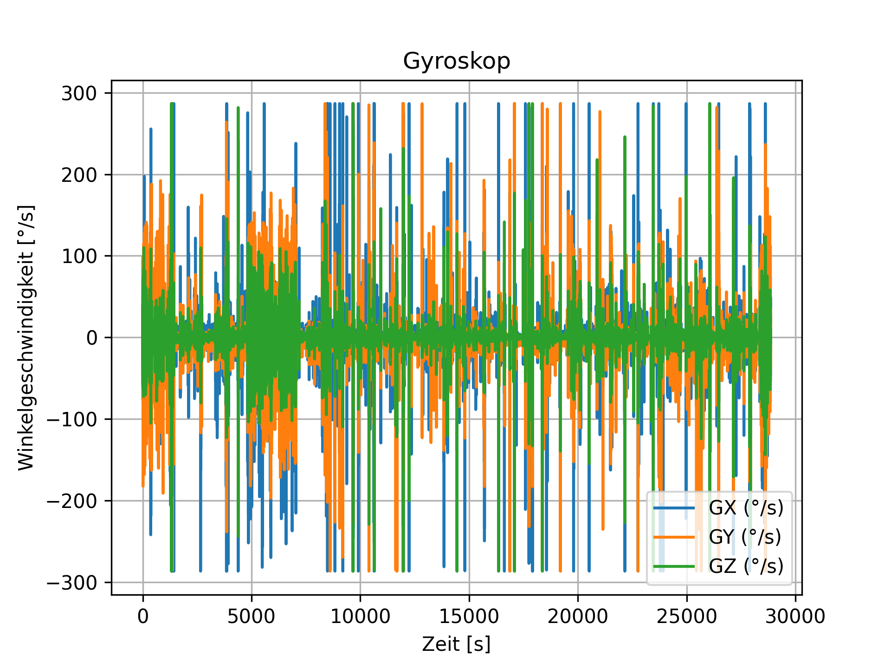

# Wearable Motion Analysis System

## Overview

This project implements a wearable real-time posture monitoring system based on IMU sensors, embedded hardware, Bluetooth Low Energy (BLE) communication, a Python desktop application, and an Android mobile application.

The system was developed as part of a master's thesis focused on the design and implementation of a low-cost wearable device for back motion capture.

The wearable prototype captures inertial data from an integrated accelerometer and gyroscope, stores measurements locally on a microSD card, and transmits data wirelessly via BLE for real-time monitoring and visualization.

---

# System Architecture

<p align="center">
  
</p>

---

# Main Features

## Wearable Embedded System

- Real-time IMU data acquisition
- Accelerometer and gyroscope measurements
- microSD local data logging
- Bluetooth Low Energy communication
- Low-power operation
- Real-time streaming

<p align="center">
  
</p>

## Python Desktop Application

- BLE communication with wearable device
- Real-time signal visualization
- Binary packet decoding
- CSV data export
- Live monitoring interface

<p align="center">
  
</p>

## Android Mobile Application

- BLE scanning and automatic device connection
- Real-time sensor visualization
- Remote control of data streaming
- Interactive signal plotting
- Mobile monitoring interface

<p align="center">
  
  
</p>

---

# Technologies

## Embedded System

- Arduino IDE
- C++
- Seeed XIAO BLE nRF52840 Sense
- BLE 5.0
- IMU Sensors

## Desktop Application

- Python
- BLE communication libraries
- Real-time plotting

## Mobile Application

- Kotlin
- Android Studio
- Bluetooth Low Energy (BLE)

---

# Repository Structure

```text
Wearable-Motion-Analysis-System/
│
├── firmware/
│   └── microcontroller/
│       └── microcontroller.ino
│
├── desktop_app/
│   ├── src/
│   └── main.py
│
├── mobile_app/
│   ├── app/
│   ├── gradle/
│   ├── build.gradle
│   ├── settings.gradle
│   └── gradlew.properties
│
├── data/
│   └── sample_dataset.csv
│
├── assets/
│   ├── screenshots/
│   ├── diagrams/
│   └── images/
│
└── README.md
```

---

# Embedded Firmware

The wearable firmware was developed using Arduino IDE for the Seeed XIAO BLE nRF52840 Sense platform.

The firmware follows a modular architecture focused on:

- continuous operation
- low-power consumption
- robust communication
- reliable data acquisition

A shared ring-buffer architecture is used to decouple:

- sensor acquisition
- BLE transmission
- microSD storage

This design minimizes data loss and improves system stability under communication latency variations.

---

# Desktop Application

The Python desktop application provides:

- BLE communication with the wearable system
- packet synchronization and decoding
- real-time signal visualization
- CSV export functionality
- persistent data recording

The software processes binary packets transmitted by the wearable device and converts them into interpretable physical units.

Displayed signals include:

- acceleration
- angular velocity
- temperature

---

# Android Mobile Application

The Android application was developed in Kotlin using Android Studio.

The application enables:

- BLE device scanning
- automatic device detection
- wireless connection management
- real-time signal visualization
- remote control of data streaming

The mobile app uses independent ring buffers for each sensor axis to optimize memory usage and support dynamic real-time plotting.

---

# Data Flow

```text
IMU Sensor
    ↓
Microcontroller Acquisition
    ↓
Ring Buffer
    ↓
├── microSD Storage
└── BLE Streaming
          ↓
 ┌─────────────────┐
 │                 │
 ↓                 ↓
Desktop App     Android App
```

---

# Hardware Components

Main hardware used in the prototype:

- Seeed XIAO BLE nRF52840 Sense 
- Integrated IMU sensor
- Integrated microSD module
- Rechargeable battery
- Custom wearable enclosure

<p align="center">
  
</p>

---

# Example Functionalities

- Continuous motion tracking
- Wireless IMU streaming
- CSV data generation
- Embedded data logging
- Cross-platform visualization

# Results

The system supports:

- long-duration data acquisition
- real-time BLE streaming
- wireless monitoring
- offline data analysis
- wearable motion tracking


Images show data acquired in a 8hr Test from Accelerometer and Gyroscope:
<p align="center">
  
  
</p>

---

# Notes

Large datasets, temporary files, and generated build files are excluded from this repository.

The full master's thesis document is not included in this repository.

---

# Future Improvements

- Multi-sensor synchronization
- Cloud-based data storage
- Machine learning posture classification
- Advanced biomechanical analysis
- Multi-device BLE networking
- Real-time posture correction feedback

---

# Author

David Enrique Veloz Renteria

---

# License

This project is intended for educational and research purposes.
